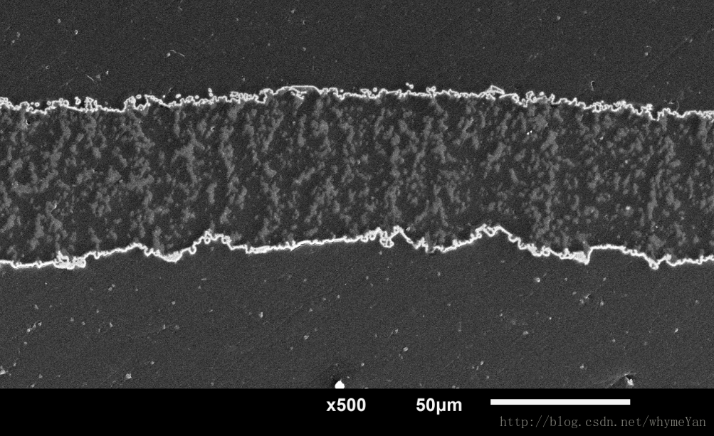
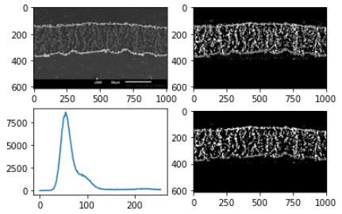
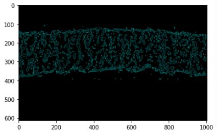

# Package for Python > 3.6
- run ```pip install opencv-python```
- run ```pip install tkinter```
- run ```pip install numpy```
- run ```pip install matplotlib```

### Jupyter notebook or Jupyter Lab.
- run ```jupyter lab``` 

### Open file 
- click buttom at ```area.ipynb ``` and run.

### Program flow
Open image file -> Image to binary -> Get mask -> Histogram -> Enhancement mask block ->
 Median blur filter -> Contours -> Draw contours area -> Calculate area.

### Input image
- 

### Results
- Plot image, filter of CV2.medianBlur and mask.
- 
- Calculate area.
- 